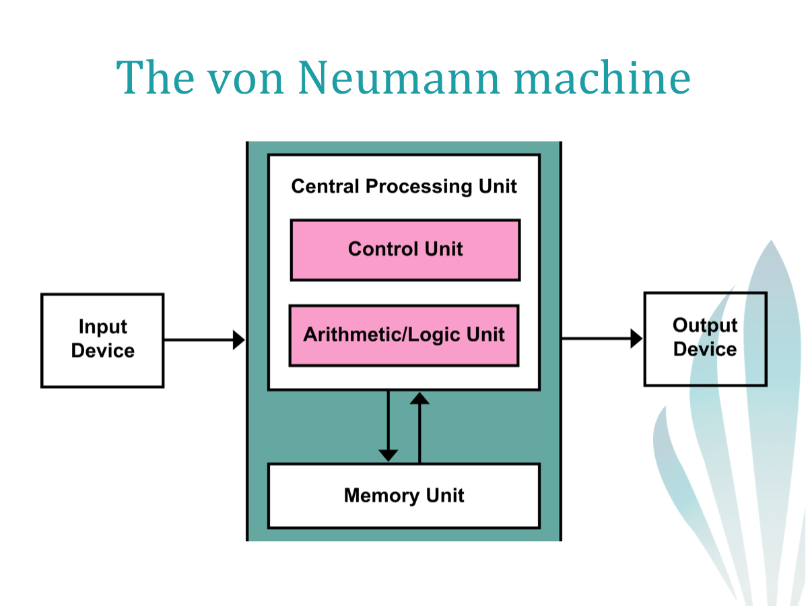

# Portfolio de Introdução a Sistemas digitais

1ª aula

Um computador é uma máquina eletronica responsável por realizar diversas tarefas. É composto por duas partes essenciais:

- Hardware: parte física do computador (componentes, rato, monitor, teclado)
- Software: parte digital fo computador (aplicações, sistema operativo, Drivers)

#### Origem da Palavra "bug"

Um "bug" é um erro na area da informática. Esta expressão surgiu nos primórdios da computação, quando os computadores ainda ocupavam salas inteiras. Os insetos, por vezes entravam nas máquinas o que fazia com que as mesmas deixassem de funcionar.

## Modelo Von-Neumann



## Sistema Digital

Um sistema digital é um sistema que trabalha com sinais digitais.

### Tipos de Sinais

Existem dois tipos de sinais:

###### Sinais analógicos:

- Medido continuamente no tempo;
- Valores Reais;

###### Sinais Digitais:

- Medições discretas;
- Valores racionais;

#### Caracteristicas:

| Sinais analógicos         | Sinais Digitais    |
| ------------------------- | ------------------ |
| Dificil de analisar       | Fácil de Analisar  |
| precisos                  | menos precisos     |
| valores ilimitados        | oscila entre 0 e 1 |
| ondas continuas           | ondas quadradas    |
| fraca resistência a ruido | resistente a ruido |
| valores ilimitados        | oscila entre 0 e 1 |
| Mais baratos              | Mais caros         |

## Sistema de numeração

Existem diversos sistemas de numeração, os mais importantes são:
| Decimal | Binário | Octal | Hexadecimal |
|---------|---------|-------|-------------|
| 0 | 0 | 0 | 0 |
| 1 | 1 | 1 | 1 |
| 2 | 10 | 2 | 2 |
| 3 | 11 | 3 | 3 |
| 4 | 100 | 4 | 4 |
| 5 | 101 | 5 | 5 |
| 6 | 110 | 6 | 6 |
| 7 | 111 | 7 | 7 |
| 8 | 1000 | 10 | 8 |
| 9 | 1001 | 11 | 9 |
| 10 | 1010 | 12 | A |
| 11 | 1011 | 13 | B |
| 12 | 1100 | 14 | C |
| 13 | 1101 | 15 | D |
| 14 | 1110 | 16 | E |
| 15 | 1111 | 17 | F |

### Unidades de Medida do sistema binário

| Unidade   | Símbolo | Equivalência em bits | Total de bits                     |
| --------- | ------- | -------------------- | --------------------------------- |
| Bit       | b       | 1                    | 1                                 |
| Byte      | B       | 8                    | 8                                 |
| Kilobyte  | KB      | 1.024 (ou 2^10)      | 8.192                             |
| Megabyte  | MB      | 1.024^2 (ou 2^20)    | 8.388.608                         |
| Gigabyte  | GB      | 1.024^3 (ou 2^30)    | 8.589.934.592                     |
| Terabyte  | TB      | 1.024^4 (ou 2^40)    | 9.223.372.036.854.775.808         |
| Petabyte  | PB      | 1.024^5 (ou 2^50)    | 1.125.899.906.842.624             |
| Exabyte   | EB      | 1.024^6 (ou 2^60)    | 1.152.921.504.606.846.976         |
| Zettabyte | ZB      | 1.024^7 (ou 2^70)    | 1.180.591.620.717.411.303.424     |
| Yottabyte | YB      | 1.024^8 (ou 2^80)    | 1.208.925.819.614.629.174.706.176 |

### Conversões

#### Binário -> Decimal

formula : valor \* 2^posição

exemplo:


#### Decimal -> Binário

Método Divisão-Resto:

- Divisão por 2 até quociente ser 1;
- obter os restos e o ultimo quociente
- Inverter a ordem (ultimo quociente -> primeiro resto)

exemplo:


## Exercícios

1.Converter de binário para decimal

1.1

0000 -> 0

1.2

1011 -> 1*2^0 + 1*2 + 1\*2^3 = 1 + 2 +8 = 11

1.3

11111111 -> 255

1.4

0101 -> 1 + 1\*2^2 = 5

1.5

11111 -> 2^0 + 2^1+ 2^2 + 2^3 +2^4 = 1 + 2 + 4+ 8 + 16 = 31

1.6

10101010 -> 1*2^1+1*2^3+1*2^5+1*2^7 = 2 +8 + 32 + 128 = 170

1.7

100001 ->1 + 1\*2^5 = 33

1.8

1001 -> 1 + 2^3 = 9

2. Decimal para binário

```

2.1


8 |2
0  4 |2
   0  2 |2
	  0  1

1000

2.2

31 |2
 1  15 |2
     1	7 |2
        1  3 |2
           1  1

11111

2.3

256 |2
 0  128 |2
     0	 64 |2
          0	 32 |2
              0	 16 |2
                  0  8 |2
                     0  4 |2
                        0  2 |2
                           0  1
1000000000

2.4

1008 |2
  0  504 |2
      0	  252 |2
           0   126 |2
                 0	63 |2
                     1 31 |2
                        1  15 |2
	                        1  7 |2
                               1  3 |2
                                  1  1

1111110000

2.5

241|2
 1  120 |2
     0	60 |2
         0  30|2
             0 15|2
                1 7|2
                  1 3|2
                    1 1
11110001

2.6

24|2
0 12|2
   0 6|2
     0 3|2
       1 1
11000

2.7

2245|2
  1  1122|2
       0  561 |2
            1  280|2
                 0 140|2
                    0  70|2
                        0 35|2
			               1 17|2
                              1 8|2
				                0 4|2
                                  0 2|2
                                    0 1
100011000101

2.8

29|2
 1 14|2
    0 7|2
      1 3|2
        1 1
11101
```

3.  | Decimal | Binário |
    | ------- | ------- |
    | 0       | 0000    |
    | 1       | 0001    |
    | 2       | 0010    |
    | 3       | 0011    |
    | 4       | 0100    |
    | 5       | 0101    |
    | 6       | 0110    |
    | 7       | 0111    |
    | 8       | 1000    |
    | 9       | 1001    |
    | 10      | 1010    |
    | 11      | 1011    |
    | 12      | 1100    |
    | 13      | 1101    |
    | 14      | 1110    |
    | 15      | 1111    |
