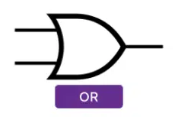
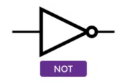
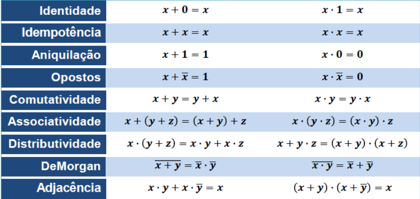
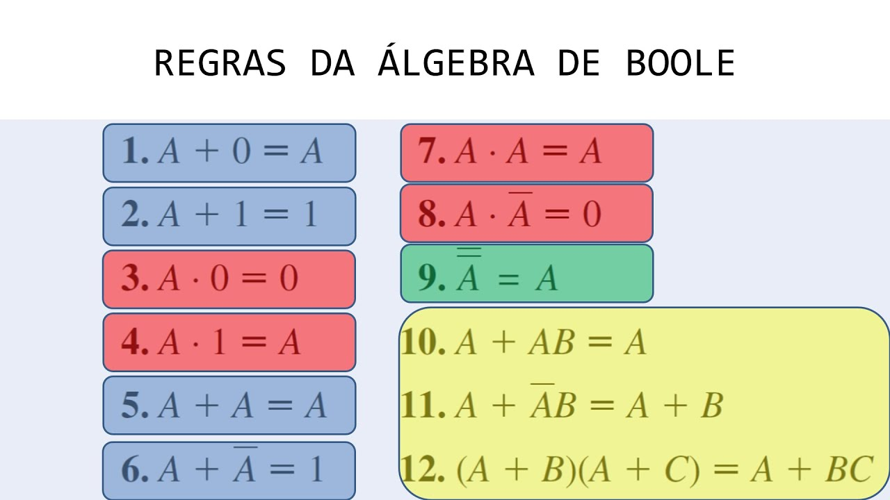

# Álgebra de Boole &nbsp; 

A **Álgebra de Boole** é um ramo da matemática que lida com variáveis e operações lógicas, desenvolvido por **George Boole** em 1854. É fundamental para a lógica digital, que alimenta o funcionamento de computadores e circuitos eletrónicos.

## Conceitos Principais

- **Sistema Binário**: A Álgebra de Boole opera com dois valores possíveis:
  - **1 e 0**
  - **Verdadeiro (True) e Falso (False)**
  - **Sim e Não**

### Diferenças entre Álgebra Tradicional e Álgebra de Boole

- A **Álgebra Tradicional** trabalha com **relações quantitativas** (ex.: operações com números).
- Já a **Álgebra de Boole** lida com **relações lógicas** (ex.: operações entre valores lógicos como verdadeiro ou falso).

## Objetivo da Álgebra de Boole

- Assim como a álgebra tradicional, a **Álgebra de Boole** procura definir um conjunto de símbolos para representar objetos ou fenómenos.
- Estes símbolos podem ser **encadeados** de maneira lógica para formar **expressões matemáticas complexas**, também chamadas de **funções**.

### O que é uma função?

Uma **função matemática** pode ser entendida como uma relação entre dois conjuntos, onde cada elemento de um conjunto (domínio) é associado a exatamente um elemento do outro conjunto (contradomínio). A função "transforma" entradas (valores do domínio) em saídas (valores do contradomínio), seguindo uma regra específica.

A função pode ser vista como uma **máquina** que transforma uma entrada num resultado de acordo com uma regra.

## Operações Básicas

1. **AND (Conjunção)**: O resultado é verdadeiro se **ambas** as entradas forem verdadeiras.
   - Matematicamente corresponde ao operador "x"
   - Exemplo: \( A ∧ B \)

| P   | Q   | P ^ Q |     | A   | B   | x = A . b |
| --- | --- | ----- | --- | --- | --- | --------- |
| V   | V   | V     |     | 1   | 1   | 1         |
| V   | F   | F     |     | 1   | 0   | 0         |
| F   | V   | F     |     | 0   | 1   | 0         |
| F   | F   | F     |     | 0   | 1   | 0         |

- Porta Lógica:

2. **OR (Disjunção)**: O resultado é verdadeiro se **pelo menos uma** das entradas for verdadeira.
   - Matematicamente corresponde ao operador "+"
   - Exemplo: \( A ∨ B \)

| A   | B   | A ∨ B |     | A   | B   | x = A + B |
| --- | --- | ----- | --- | --- | --- | --------- |
| F   | F   | F     |     | 0   | 0   | 0         |
| F   | V   | V     |     | 0   | 1   | 1         |
| V   | F   | V     |     | 1   | 0   | 1         |
| V   | V   | V     |     | 1   | 1   | 1         |

- Porta Lógica:

1. **NOT (Negação)**: Inverte o valor da entrada.
   - Exemplo: \(¬A \) ou (A') ou (~A)

| A   | A'  |     | A   | A'  |
| --- | --- | --- | --- | --- |
| V   | F   |     | 1   | 0   |
| F   | V   |     | 0   | 1   |

- Porta Lógica:

## Regras da Álgebra de Boole

- A **Álgebra de Boole** define leis que governam o funcionamento destas funções lógicas e as suas relações.
- Estas leis são formuladas através de:
  - **Propriedades**
  - **Postulados**
  - **Teoremas**

### Propriedades Básicas

### Postulados

a + 1 = 1

a + 0 = a

a . 1 = a

a . 0 = 0

a + a = a

a + a' = 1

a . a' = 0

(a)'' = a

S = a + b <=> S' = (a + b)'
S = a . b <=> S' = (a . b)'

### Teoremas

a + a . b = a
a . (a + b) = a

a + a' . b = a + b
b . (a + b') = a . b

(a + b)' = a' . b'
(a . b)' = a' + b'

Resumindo, as principais regras são:

---

Aplicação da Álgebra de Boole:

[Exercícios Álgebra de Boole](/fichas/algebra_de_boole/exercicios.md)

[Ficha de Trabalho](/fichas/algebra_de_boole/ficha%20de%20trabalho.md)
