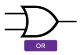
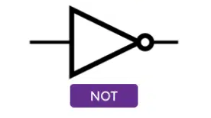

# Circuitos Lógicos &nbsp; 

Os circuitos lógicos têm como base as operações da Álgebra de Boole, e são fundamentais para o funcionamento de sistemas digitais. Estas operações simplificam a representação de estados em sistemas eletrónicos, limitando-os aos valores binários 0 e 1.

## Operações Lógicas Básicas

### 1. Operação OR (OU)
A operação OR, também conhecida como **soma lógica**, retorna o valor 1 quando **pelo menos uma das entradas** é 1.

- **Expressão matemática:** $S=A+B$
- **Descrição:** Retorna 1 se $A$ ou $B$ forem 1.

**Tabela de Verdade:**
| A | B | S (A + B) |
|---|---|-----------|
| 0 | 0 |     0     |
| 0 | 1 |     1     |
| 1 | 0 |     1     |
| 1 | 1 |     1     |

### 2. Operação AND (E)
A operação AND, também conhecida como **produto lógico**, retorna o valor 1 quando **ambas as entradas** são 1.

- **Expressão matemática:** $S=A\cdot B$
- **Descrição:** Retorna 1 apenas se $A$ e $B$ forem ambos 1.

**Tabela de Verdade:**

| A   | B   | $S=A\cdot B$ |
| --- | --- | ------------ |
| 0   | 0   | 0            |
| 0   | 1   | 0            |
| 1   | 0   | 0            |
| 1   | 1   | 1            |

### 3. Operação NOT (NÃO)
A operação NOT, também conhecida como **negação** ou **complemento**, inverte o valor lógico da entrada.

- **Expressão matemática:** $S=\overline{A}$
- **Descrição:** Se $A=1$, então $S=0$ e vice-versa.

**Tabela de Verdade:**

| A   | $S=\overline{A}$ |
| --- | ---------------- |
| 0   | 1                |
| 1   | 0                |

## Portas Lógicas

### 1. Porta NAND
A porta NAND realiza uma operação **NOT AND**. A saída é 1 exceto quando **ambas as entradas** são 1.

- **Expressão matemática:** $S=\neg(A\cdot B)$
- **Descrição:** Retorna 1, a menos que $A$ e $B$ sejam ambos 1.

**Tabela de Verdade:

| A   | B   |  $S=\neg(A\cdot B)$ |
| --- | --- | ------------------------ |
| 0   | 0   | 1                        |
| 0   | 1   | 1                        |
| 1   | 0   | 1                        |
| 1   | 1   | 0                        |

### 2. Porta NOR
A porta NOR realiza uma operação **NOT OR**. A saída é 1 apenas quando **todas as entradas** são 0.

- **Expressão matemática:** $S=\neg(A+B)$
- **Descrição:** Retorna 1 apenas se $A$ e $B$ forem ambos 0.

**Tabela de Verdade:**

| A   | B   | $S=\neg(A+B)$ |
| --- | --- | ------------------ |
| 0   | 0   | 1                  |
| 0   | 1   | 0                  |
| 1   | 0   | 0                  |
| 1   | 1   | 0                  |

### 3. Porta XOR (OU Exclusivo)
A porta XOR retorna o valor 1 apenas se **um número ímpar de entradas** for 1.

- **Expressão matemática:** $S=A\oplus B$
- **Descrição:** Retorna 1 se $A$ e $B$ tiverem valores diferentes.

**Tabela de Verdade:**

| A   | B   | $S=A\oplus B$ |
| --- | --- | ------------- |
| 0   | 0   | 0             |
| 0   | 1   | 1             |
| 1   | 0   | 1             |
| 1   | 1   | 0             |

### 4. Porta XNOR
A porta XNOR é a **porta XOR com a saída invertida**. Retorna 1 se **ambas as entradas forem iguais**.

- **Expressão matemática:** $S=\neg(A\oplus B)$
- **Descrição:** Retorna 1 se $A$ e $B$ forem ambos 0 ou ambos 1.

**Tabela de Verdade:**

| A   | B   | $S=\neg(A\oplus B)$ |
| --- | --- | ------------------------ |
| 0   | 0   | 1                        |
| 0   | 1   | 0                        |
| 1   | 0   | 0                        |
| 1   | 1   | 1                        |

## Portas Lógicas Universais

As **portas lógicas universais** são portas lógicas que podem ser usadas para implementar qualquer outra porta lógica. As principais portas universais são:
### 1. Porta NAND

- **NOT**: Ligando ambas as entradas ao mesmo sinal.  
  - Fórmula: `NOT A = A NAND A`
 

- **AND**: Porta NAND seguida de um inversor.  
  - Fórmula: `A AND B = (A NAND B) NAND (A NAND B)`
 

- **OR**: Combinando várias portas NAND.  
  - Fórmula: `A OR B = (A NAND A) NAND (B NAND B)`
 

### 2. Porta NOR 

- **NOT**: Ligando ambas as entradas ao mesmo sinal.  
  - Fórmula: `NOT A = A NOR A`
 

- **AND**: Combinando várias portas NOR.  
  - Fórmula: `A AND B = (A NOR B) NOR (A NOR B)`
 

- **OR**: Porta NOR seguida de um inversor.  
  - Fórmula: `A OR B = (A NOR A) NOR (B NOR B)`
 

