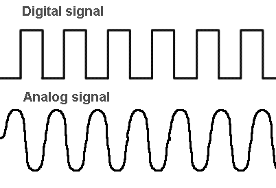
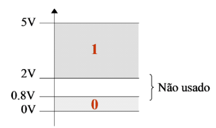

# Sistema &nbsp; 

- Um **sistema** é um conjunto de dispositivos/componentes que são interligados, para desempenharem uma determinada função.
- Um **sistema digital** é uma combinação de dispositivos/componentes, projetado para manipular grandezas físicas representadas em formato digital.

## Dispositivo

Um **dispositivo** é um circuito que desempenha uma função simples, é constituído por vários **componentes**.

Exemplo:
Um processador é um sistema digital constituído por diversos dispositivos – memórias, registos, somadores,... – os quais são por sua vez constituídos por vários componentes – resistências, díodos, transístores,...

## Sinais

Um sistema, comunica com o exterior através de **sinais**:

- **Sinais de entrada**: Utilizado para receber informação do exterior;
- **Sinais de saída**: Utilizado para receber informação do interior;

### Sinais analógicos e digitais

Existem dois tipos de sinais:

#### Sinais analógicos:

- Medido continuamente no tempo;
- Valores Reais;

#### Sinais Digitais:

- Medições discretas;
- Valores racionais;

#### Comparação:

| Sinais analógicos         | Sinais Digitais    |
| ------------------------- | ------------------ |
| Dificil de analisar       | Fácil de Analisar  |
| precisos                  | menos precisos     |
| valores ilimitados        | oscila entre 0 e 1 |
| ondas continuas           | ondas quadradas    |
| fraca resistência a ruido | resistente a ruido |
| Mais baratos              | Mais caros         |

### Representação física da informação Binária

Em termos físicos, a informação binária presente nas entradas e saídas dos circuitos que constituem o sistema digital, é normalmente representada por dois níveis de tensão: o valor 1 associado a um dos níveis e o valor 0 ao outro.

Na prática, os valores (0;1) correspondem a **gamas** de tensão:

