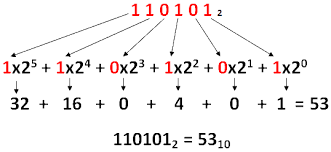
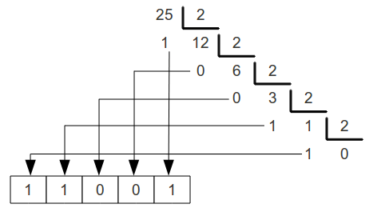

# Sistemas de numeração &nbsp; 

Existem diversos sistemas de numeração, os mais importantes são:

| Decimal | Binário | Octal | Hexadecimal |
| ------- | ------- | ----- | ----------- |
| 0       | 0       | 0     | 0           |
| 1       | 1       | 1     | 1           |
| 2       | 10      | 2     | 2           |
| 3       | 11      | 3     | 3           |
| 4       | 100     | 4     | 4           |
| 5       | 101     | 5     | 5           |
| 6       | 110     | 6     | 6           |
| 7       | 111     | 7     | 7           |
| 8       | 1000    | 10    | 8           |
| 9       | 1001    | 11    | 9           |
| 10      | 1010    | 12    | A           |
| 11      | 1011    | 13    | B           |
| 12      | 1100    | 14    | C           |
| 13      | 1101    | 15    | D           |
| 14      | 1110    | 16    | E           |
| 15      | 1111    | 17    | F           |

## Unidades de Medida do sistema binário

| Unidade   | Símbolo | Equivalência em bits | Total de bits                     |
| --------- | ------- | -------------------- | --------------------------------- |
| Bit       | b       | 1                    | 1                                 |
| Byte      | B       | 8                    | 8                                 |
| Kilobyte  | KB      | 1.024 (ou 2^10)      | 8.192                             |
| Megabyte  | MB      | 1.024^2 (ou 2^20)    | 8.388.608                         |
| Gigabyte  | GB      | 1.024^3 (ou 2^30)    | 8.589.934.592                     |
| Terabyte  | TB      | 1.024^4 (ou 2^40)    | 9.223.372.036.854.775.808         |
| Petabyte  | PB      | 1.024^5 (ou 2^50)    | 1.125.899.906.842.624             |
| Exabyte   | EB      | 1.024^6 (ou 2^60)    | 1.152.921.504.606.846.976         |
| Zettabyte | ZB      | 1.024^7 (ou 2^70)    | 1.180.591.620.717.411.303.424     |
| Yottabyte | YB      | 1.024^8 (ou 2^80)    | 1.208.925.819.614.629.174.706.176 |

## Conversões entre sistemas de numeração

### Qualquer sistema para Decimal

formula :

$$
\sum_{{Pos+direita}}^{{Pos+esquerda}} \text{dígito} \cdot \text{Base}^{Pos}
$$

exemplo:

### Decimal para qualquer outro sistema

- Divisão do valor pela base até não dar mais;
- obter os restos e o ultimo quociente;
- Inverter a ordem (ultimo quociente -> primeiro resto)

exemplo:

[Exercicios de conversões entre sistema decimal e binário](/fichas/sistemas_numeracao/conversoes_binario_decimal.md)

#### Valores com parte fracionária

- Separar a parte inteira da parte fracionária;
- Dividir a parte inteira;
- De seguida a parte fracionária (mas neste caso multiplicamos em vez de dividirmos) até a primeira repetição;

Exemplo 20,35:

Dividimos 20 de forma sucessiva por 2, anotando os restos:
• 20÷2=10 (resto 0)
• 10÷2=5 (resto 0)
• 5÷2=2 (resto 1)
• 2÷2=1 (resto 0)
• 1÷2=0 (resto 1)

Agora, lemos os restos de baixo para
cima e assim obtemos: 10100(2)

Para converter a parte fracionária, multiplicamos por 2 e anotamos as
partes inteiras obtidas até que o resultado seja zero ou até uma precisão
desejada:

• 0.35×2=0.70 → Parte inteira: 0
• 0.70×2=1.40 → Parte inteira: 1
• 0.40×2=0.80 → Parte inteira: 0
• 0.80×2=1.60 → Parte inteira: 1
• 0.60×2=1.20 → Parte inteira: 1
• 0.20×2=0.40 → Parte inteira: 0
• 0.40×2=0.80 → Parte inteira: 0 (repetição)

Assim, a parte fracionária é
aproximadamente 010110(2)

20,35​(10) corresponde aproximadamente em 10100,010110(2)

### Binário -> Octal

- Dividir em grupos de 3 e fazer os cálculos

Exemplo:

100101(2)
100 -> 4
101 -> 5
45(8)

### Octal -> Binário

- Transformar cada digito para binário individualmente

Exemplo:

576(8)
5 -> 101
7 -> 111
6 -> 110
101111110(2)

### Binário -> hexadecimal

- Dividir em grupos de 4 e fazer os cálculos

### Hexadecimal -> Binário

- Transformar cada digito para binário individualmente

### Octal -> Hexadecimal

- Transformar para binário e de seguida para hexadecimal

### Hexadecimal -> Octal

- Transformar para binário e de seguida para Octal

[Exercícios de conversões](/fichas/sistemas_numeracao/conversoes.md)
