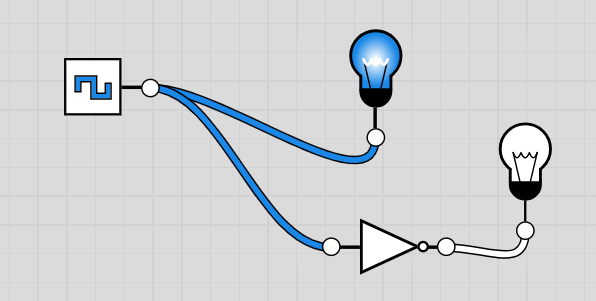
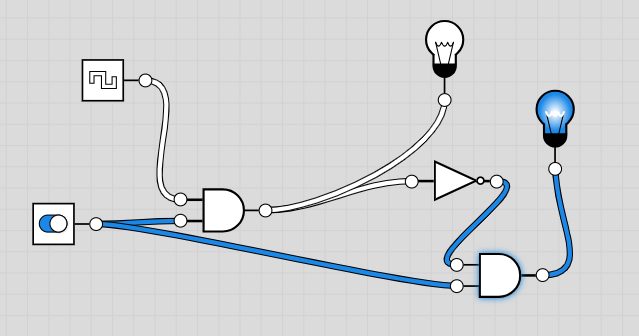

1. O que é uma porta lógica? 

Uma porta lógica é um dispositivo que recebe um ou mais sinais de entrada e cria um sinal de saída.

2. O que é um inversor? 

Um inversor, inverte o sinal de entrada.

3. Em que situação a operação lógica NOT gera uma saída de nível “alto”?

Quando o sinal de entrada é 0 ("baixo").

4. Em que situação a operação lógica AND gera uma saída de nível “alto”?

Quando os sinais de entradas são todos 1 ("alto").

5. Em que situação a operação lógica OR gera uma saída de nível “alto”?

Quando pelo menos um dos sinais de entrada é 1 ("alto").

6. Identifique cada uma das portas lógicas e escreva para cada uma as respetivas tabelas de verdade e expressão booleana.

a)
Porta Lógica OR

| A   | B   | A + B |
| --- | --- | ----- |
| 0   | 0   | 0     |
| 0   | 1   | 1     |
| 1   | 0   | 1     |
| 1   | 1   | 1     |

b)
Porta Lógica AND

| A   | B   | A . B |
| --- | --- | ----- |
| 0   | 0   | 0     |
| 0   | 1   | 0     |
| 1   | 0   | 0     |
| 1   | 1   | 1     |

c)
Porta Lógica NOT

| A   | A'  |
| --- | --- |
| 0   | 1   |
| 1   | 0   |

d) 
Porta Lógica NOR

| A   | B   | (A + B)' |
| --- | --- | -------- |
| 0   | 0   | 1        |
| 0   | 1   | 0        |
| 1   | 0   | 0        |
| 1   | 1   | 0        |

e)
Porta Lógica NAND

| A   | B   | (A . B)' |
| --- | --- | -------- |
| 0   | 0   | 1        |
| 0   | 1   | 1        |
| 1   | 0   | 1        |
| 1   | 1   | 0        |

7. Implemente as seguintes tabelas de verdade:

| Situação | A   | B   | C   | D   | Q = A.B.C.D | Assinale a situação em que a luz acende |
| -------- | --- | --- | --- | --- | ----------- | --------------------------------------- |
| 1)       | 0   | 0   | 1   | 1   | 0           |                                         |
| 2)       | 1   | 0   | 0   | 1   | 0           |                                         |
| 3)       | 1   | 1   | 1   | 1   | 1           | x                                       |
| 4)       | 1   | 1   | 0   | 0   | 0           |                                         |
| 5)       | 0   | 0   | 0   | 0   | 0           |                                         |

| Situação | A   | B   | C   | D   | Q = A+B+C+D | Assinale a situação em que a luz acende |
| -------- | --- | --- | --- | --- | ----------- | --------------------------------------- |
| 1)       | 0   | 0   | 1   | 1   | 1           | x                                       |
| 2)       | 1   | 0   | 0   | 1   | 1           | x                                       |
| 3)       | 1   | 1   | 1   | 1   | 1           | x                                       |
| 4)       | 1   | 1   | 0   | 0   | 1           | x                                       |
| 5)       | 0   | 0   | 0   | 0   | 0           |                                         |

8. Através de um browser da internet aceda ao link: http://logic.ly/demo/ 
8.1. Coloque duas lâmpadas a funcionar intermitentemente de forma intercalada (quando uma está acesa a outra está apagada). 
	

	
8.2. Coloque no sistema desenvolvido no ponto anterior (8.1 um interruptor de forma a poder ligar ou desligar o sistema.

