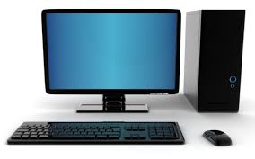

# Computador &nbsp; 

Um computador é uma máquina eletronica responsável por realizar diversas tarefas de acordo com um conjunto de instruções. É composto por duas partes essenciais:

- Hardware: parte física do computador (componentes, rato, monitor, teclado)
- Software: parte digital do computador (aplicações, sistema operativo, Drivers)

