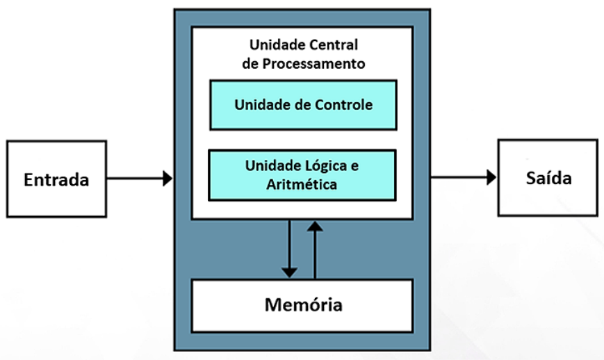

# 
Arquitetura de Von-Neumann

A **arquitetura de Von Neumann** é caracterizada por quatro componentes principais:

- **Unidade Central de Processamento (CPU)**: A CPU é o cérebro do computador, responsável por executar instruções armazenadas na memória. Ela consiste na **Unidade Lógica e Aritmética** (ULA), que realiza operações matemáticas e lógicas, e na **Unidade de Controle** (UC), que coordena as operações do processador.
- **Memória Principal**: A memória principal armazena tanto dados quanto instruções. Ela é acessada sequencialmente por meio de endereços específicos. A distinção entre dados e instruções é fundamental para a execução de programas, seguindo o conceito de programa armazenado.
- **Unidade de Entrada/Saída**: Responsável pela interação do computador com o mundo exterior, a Unidade de Entrada/Saída facilita a entrada de dados (por exemplo, teclado e mouse) e a saída de resultados (por exemplo, monitor e impressora).
- **Sistema de Barramento**: O sistema de barramento é um conjunto de linhas de comunicação que conecta a CPU, a memória e a Unidade de Entrada/Saída. Ele possibilita a transferência de dados e instruções entre esses componentes.

